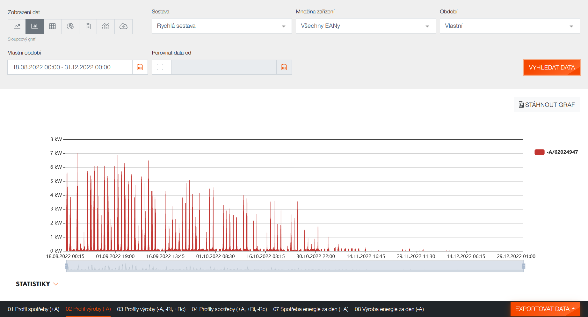
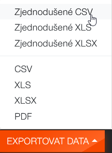

# Výpoèet prùmìrné spotové ceny

Skript dokáže zpracovat data z distribuèního portálu ÈEZu a doplnit je o cenu za MWh v € a kurzem z ÈNB platným v daný okamžik pøetoku.

Data o cenì elektrické energie se stahují z  https://www.ote-cr.cz
Kurz se stahuje z https://www.cnb.cz/cs/financni-trhy/devizovy-trh/kurzy-devizoveho-trhu

## Parametry skriptu

- -i/--input - název vstupního souboru csv pro zpracování
- -o/--output - název výstupního souboru csv
- -p/--progress - zobrazuje aktuálnì zpracovávaný den

## Formát vstupního csv souboru

Skript zpracovává jen øádky, kde je v prvním sloupeèku datum ve formátu a v druhém sloupeèku výroba viz ukázka:

```
"Datum";"-A/XXXX [kW]";"Status";
18.08.2022 00:15;0;namìøená data OK;
18.08.2022 00:30;0;namìøená data OK;
18.08.2022 00:45;0;namìøená data OK;
18.08.2022 01:00;0;namìøená data OK;
18.08.2022 01:15;0;namìøená data OK;
18.08.2022 01:30;0;namìøená data OK;
18.08.2022 01:45;0;namìøená data OK;
18.08.2022 02:00;0;namìøená data OK;
18.08.2022 02:15;0;namìøená data OK;
18.08.2022 02:30;0;namìøená data OK;
18.08.2022 02:45;0;namìøená data OK;
18.08.2022 03:00;0;namìøená data OK;
18.08.2022 03:15;0;namìøená data OK;
18.08.2022 03:30;0;namìøená data OK;
18.08.2022 03:45;0;namìøená data OK;
18.08.2022 04:00;0;namìøená data OK;
18.08.2022 04:15;0;namìøená data OK;
18.08.2022 04:30;0;namìøená data OK;
18.08.2022 04:45;0;namìøená data OK;
```

## Vygenerování vstupních dat z https://pnd.cezdistribuce.cz/cezpnd2/external/dashboard/view ( https://dip.cezdistribuce.cz/ )

1. Vyberte období, pro které chcete data zpracovat v položce `Vlastní období`
2. Vyberte zobrazení `Sloupcový graf` a `02 Profil výroby (-A)`



3. Vagenerujte soubor pomocí `Exportovat data` a `Zjednodušené CSV` 

